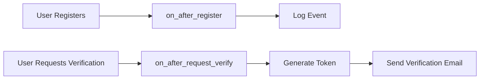
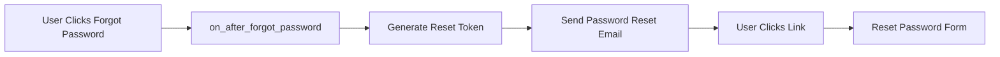

# Email Service Implementation

## Overview

FamilyCart's email service provides automated email functionality for user verification, password recovery, and shopping list invitations. Built with async/await support using `aiosmtplib` and Jinja2 templates with Family Warmth branding.

## Features

✅ **Email Verification** - Sent when user registers or requests verification  
✅ **Password Reset** - Sent when user requests password recovery  
✅ **List Invitation (Existing Users)** - Direct link to specific shopping list  
✅ **List Invitation (New Users)** - Registration link with invitation token  

## Configuration

### Environment Variables

Required in `.env` file:

```bash
# Email Provider Selection
EMAIL_PROVIDER=brevo  # Options: console, brevo, smtp

# Sender Configuration
FROM_EMAIL=noreply@familycart.app
FROM_NAME=FamilyCart
FRONTEND_URL=https://familycart.app

# Brevo SMTP (Production)
BREVO_SMTP_HOST=smtp-relay.brevo.com
BREVO_SMTP_PORT=587
BREVO_SMTP_USER=your-brevo-login
BREVO_SMTP_PASSWORD=your-brevo-api-key

# Generic SMTP (Alternative)
SMTP_HOST=smtp.example.com
SMTP_PORT=587
SMTP_USER=your-smtp-user
SMTP_PASSWORD=your-smtp-password
SMTP_USE_TLS=false
SMTP_START_TLS=true

# Token Expiration Times (seconds)
VERIFICATION_TOKEN_LIFETIME_SECONDS=172800  # 48 hours
RESET_PASSWORD_TOKEN_LIFETIME_SECONDS=3600  # 1 hour
INVITATION_TOKEN_LIFETIME_SECONDS=604800    # 7 days
```

### Brevo Setup

1. **Create Account**: Sign up at [brevo.com](https://www.brevo.com)
2. **Get SMTP Credentials**: 
   - Go to Settings → SMTP & API
   - Generate SMTP credentials
3. **Authenticate Domain**:
   - Add your domain in Settings → Senders & IP
   - Add DNS records to your domain provider:
     - SPF: `v=spf1 include:spf.brevo.com ~all`
     - DKIM: (provided by Brevo)
     - DMARC: `v=DMARC1; p=none; rua=mailto:postmaster@yourdomain.com`
4. **Verify Domain**: Wait for DNS propagation and verify in Brevo dashboard

## Architecture

### Email Providers

```
EmailProvider (Abstract Base)
├── ConsoleEmailProvider (Development)
├── SMTPEmailProvider (Production)
│   ├── Brevo SMTP
│   └── Generic SMTP
```

**ConsoleEmailProvider**: Prints emails to console (development mode)  
**SMTPEmailProvider**: Sends via SMTP with TLS/STARTTLS support

### Email Service

Located in `app/services/email_service.py`:

```python
from app.services.email_service import get_email_service

email_service = get_email_service()

# Send verification email
await email_service.send_verification_email(
    recipient="user@example.com",
    token="verification-token-123"
)

# Send password reset email
await email_service.send_password_reset_email(
    recipient="user@example.com",
    token="reset-token-456"
)

# Send invitation to existing user
await email_service.send_invitation_email(
    recipient="user@example.com",
    inviter_name="John Doe",
    list_name="Weekend Shopping",
    list_id="abc123-list-id"
)

# Send invitation to new user
await email_service.send_invitation_email(
    recipient="newuser@example.com",
    inviter_name="Jane Smith",
    list_name="Family Groceries",
    invitation_token="invite-token-789"
)
```

## Integration with fastapi-users

Email service is automatically triggered via UserManager hooks in `app/core/users.py`:

### Registration Flow



### Password Reset Flow



## Email Templates

Templates located in `app/templates/email/`:

### Base Template (`base.html`)

Provides consistent branding with:
- Orange gradient header with FamilyCart logo
- Gradient buttons with hover effects
- Info/Success/Warning boxes with gradients
- Mobile-responsive design
- Footer with legal text

### Template Features

**Visual Identity**:
- Uses lucide-react SVG icons (matching frontend)
- Family Warmth brand colors: Orange #f59e0b, Blue #3b82f6, Green #22c55e
- Gradient backgrounds for depth
- Box shadows for elevation
- Plus Jakarta Sans (headings) and Noto Sans (body)

**Email Client Compatibility**:
- Table-based layout for broad support
- Inline CSS styles
- No external dependencies
- Tested in Gmail, Outlook, Apple Mail

## API Endpoints

### Authentication Endpoints

```
POST   /api/v1/auth/register          # Register new user
POST   /api/v1/auth/jwt/login         # Login
POST   /api/v1/auth/jwt/logout        # Logout
POST   /api/v1/auth/reset-password    # Request password reset
POST   /api/v1/auth/verify            # Request verification email
GET    /api/v1/auth/verify?token=xxx  # Verify email
```

### Frontend URLs

Generated in email templates:

- **Verification**: `{FRONTEND_URL}/auth/verify?token={token}`
- **Password Reset**: `{FRONTEND_URL}/auth/reset-password?token={token}`
- **Existing User Invitation**: `{FRONTEND_URL}/lists/{list_id}`
- **New User Invitation**: `{FRONTEND_URL}/auth/register?invitation={token}`

## Testing

### Test Scripts

```bash
# Test all email templates
poetry run python test_all_templates.py

# Test email service directly
poetry run python test_brevo_email.py

# Test UserManager integration
poetry run python test_user_email_integration.py
```

### Manual Testing

1. **Console Mode** (Development):
   ```bash
   EMAIL_PROVIDER=console poetry run python test_all_templates.py
   ```
   Emails print to console instead of sending.

2. **Real SMTP Testing**:
   ```bash
   EMAIL_PROVIDER=brevo poetry run python test_all_templates.py
   ```
   Sends real emails via Brevo to test address.

## Email Templates Content

### Verification Email

**Subject**: Verify Your Email - FamilyCart  
**Icon**: CheckCircle (gradient orange/red background)  
**CTA Button**: "Verify Email Address"  
**Features List**:
- Create and share shopping lists with family
- Get AI-powered suggestions and categorization
- Check off items in real-time across all devices
- Collaborate with family in real-time

### Password Reset Email

**Subject**: Reset Your Password - FamilyCart  
**Icon**: Lock (gradient orange/red background)  
**CTA Button**: "Reset My Password"  
**Password Tips**:
- Use at least 8 characters
- Mix uppercase and lowercase letters
- Include numbers and special characters
- Avoid common words or personal information

**Expiry Warning**: 1 hour expiration notice

### Invitation Email (Existing User)

**Subject**: {inviter_name} invited you to collaborate on {list_name}  
**Icon**: Users (gradient green background)  
**CTA Button**: "View Shopping List" (green gradient)  
**Features**:
- Add and organize items together
- See updates in real-time
- Use AI for smart suggestions
- Check off items from any device

**URL**: Direct link to specific list `/lists/{list_id}`

### Invitation Email (New User)

**Subject**: {inviter_name} invited you to collaborate on {list_name}  
**Icon**: ShoppingCart (gradient orange/red background)  
**CTA Button**: "Create Account & Join"  
**What is FamilyCart Section**:
- Share lists in real-time with family
- Get AI-powered item suggestions
- Organize with smart categories
- Access from any device, anywhere

**URL**: Registration with invitation token `/auth/register?invitation={token}`  
**Invitation Validity**: 7 days

## Monitoring & Logging

All email operations are logged:

```python
import logging
logger = logging.getLogger(__name__)

# Success logs
logger.info(f"Verification email sent to {user.email}")

# Error logs (non-blocking)
logger.error(f"Failed to send email to {user.email}: {error}")
```

**Note**: Email failures don't block user flows (registration, password reset, etc.)

## Production Checklist

- [ ] Brevo account created and verified
- [ ] Domain authenticated in Brevo
- [ ] DNS records configured (SPF, DKIM, DMARC)
- [ ] BREVO_SMTP_USER and BREVO_SMTP_PASSWORD in production `.env`
- [ ] EMAIL_PROVIDER=brevo in production
- [ ] FROM_EMAIL matches authenticated domain
- [ ] FRONTEND_URL set to production domain
- [ ] Test all 4 email types in production
- [ ] Verify emails not landing in spam
- [ ] Monitor Brevo dashboard for delivery rates

## Troubleshooting

### Emails not sending

1. Check EMAIL_PROVIDER setting
2. Verify SMTP credentials in `.env`
3. Check logs for error messages
4. Test SMTP connection: `poetry run python test_brevo_email.py`

### Emails landing in spam

1. Verify SPF record: `nslookup -type=txt yourdomain.com`
2. Check DKIM in Brevo dashboard
3. Add DMARC record
4. Warm up domain by sending gradually increasing volumes

### Template rendering errors

1. Check Jinja2 syntax in template files
2. Verify all context variables are provided
3. Check template path in TEMPLATES_DIR

### Token expiration issues

1. Adjust token lifetime settings in `.env`
2. Check user timezone vs server timezone
3. Verify token generation timestamp

## Future Enhancements

- [ ] Email analytics and open tracking
- [ ] Unsubscribe management
- [ ] Email preferences per user
- [ ] Rich email previews in email clients
- [ ] Localization support for multiple languages
- [ ] Email templates for list updates/reminders
- [ ] Batch invitation emails
- [ ] Email queue for high volume

## Dependencies

```toml
aiosmtplib = "^3.0.0"      # Async SMTP client
email-validator = "^2.1.0"  # Email validation
jinja2 = "^3.1.0"           # Template engine
```

## References

- [fastapi-users Documentation](https://fastapi-users.github.io/fastapi-users/)
- [Brevo SMTP Documentation](https://developers.brevo.com/docs/send-a-transactional-email)
- [aiosmtplib Documentation](https://aiosmtplib.readthedocs.io/)
- [Email on Acid - HTML Email Support](https://www.emailonacid.com/)
